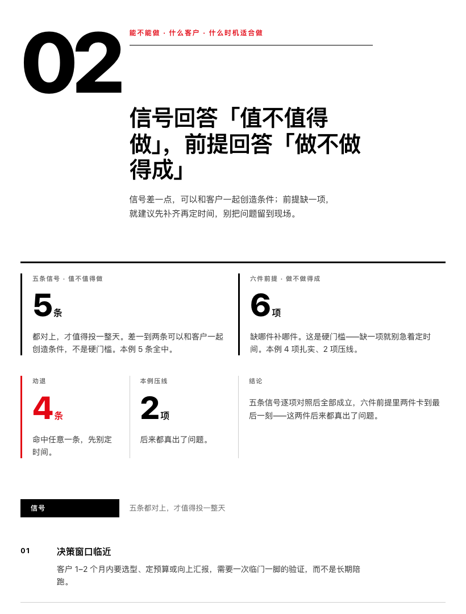
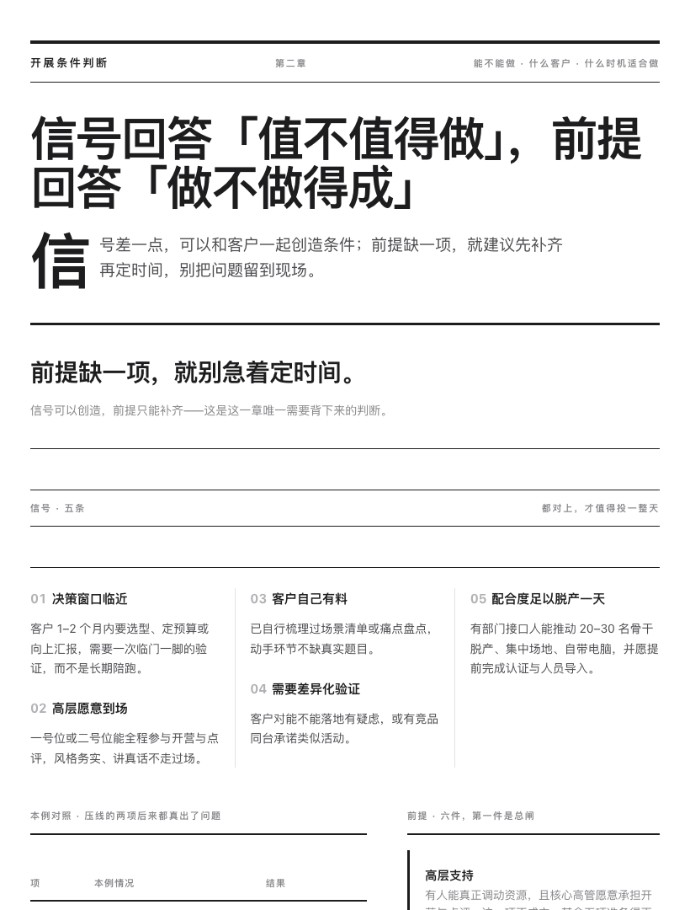
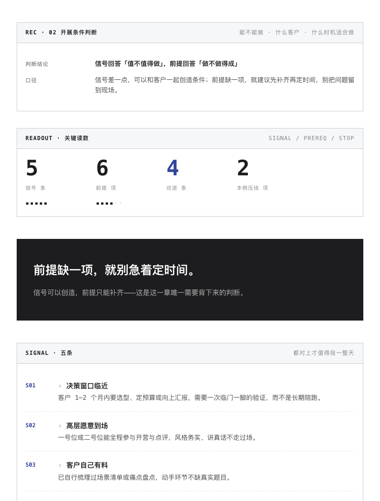
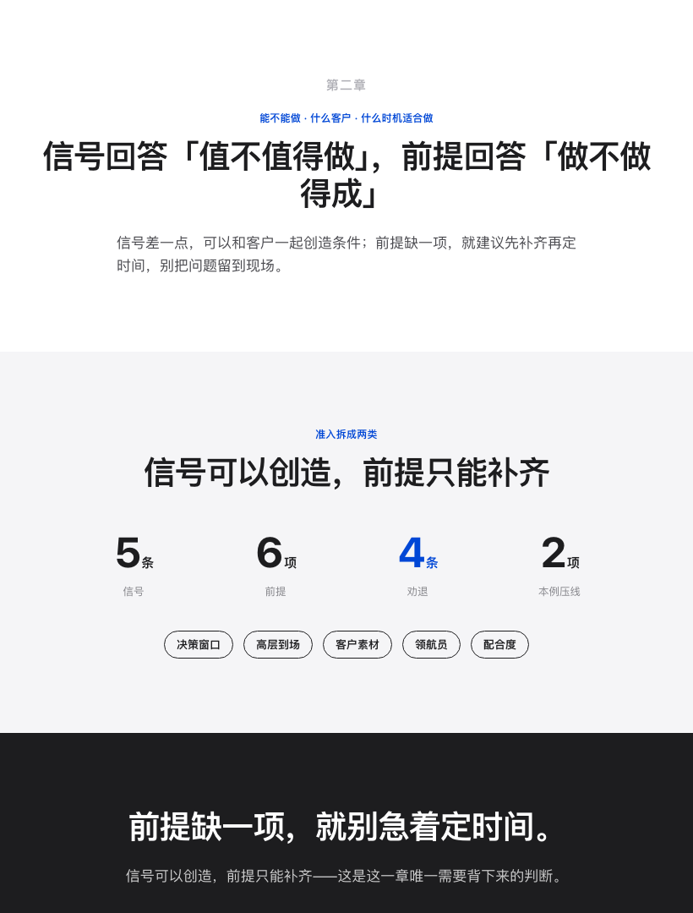
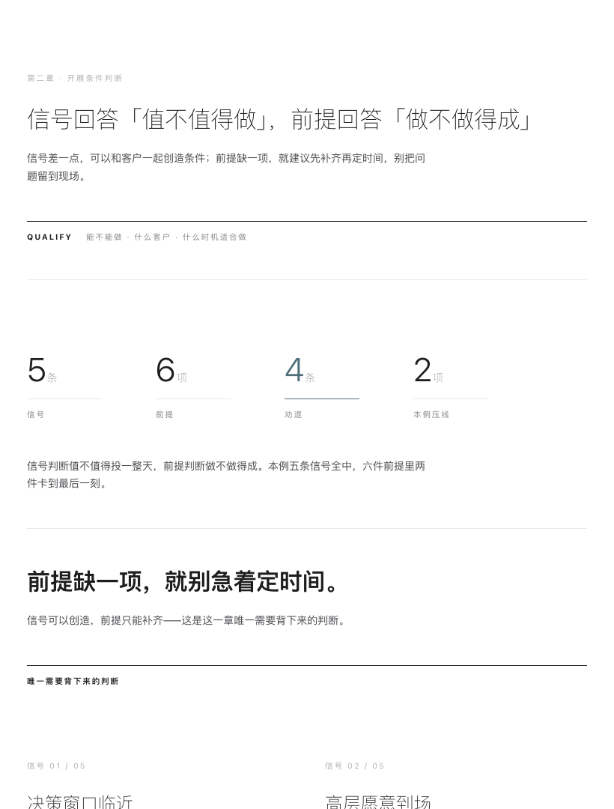

# 复盘文档 HTML skill

> skill 名 `retro-doc-builder`｜在豆包里说一句复盘需求即可触发

把一场活动、项目或客户交付，复盘成**下一个人能照着做**的飞书文档。

不是记录发生了什么，而是让复用者知道自己该在哪一步做什么判断。

```
Skill for Doubao / Claude Code · 复盘文档生产线 · 5 套版面架构
```

---

## 一眼看到的差别

同一份内容（第二章「开展条件判断」），五种版面架构。**不是换配色，是换页面怎么组织**——报头形态、阅读顺序、信息容器全都不同。

截图按飞书正文真实宽度 **820px** 渲染。

### t-swiss｜海报式 12 栏网格

150px 序号占 1–4 栏，正文全部从第 4 栏悬挂；数据按栏位落位（span 3/4/6）而不是等分格子；分节是横贯的实心黑条 + 反白字。

> 判据：「grid 不是隐藏的，它是设计**可见的骨架**」——元素错过网格线是缺陷，不是选择。



### t-editorial｜报纸头版

报头 + 56px 大标题 + 首字下沉（`::first-letter` 浮左三行高）；条目走**真正的三栏正文流 + 栏间竖线**；抽言打断栏流形成视觉标点；下方表格与 300px 边栏并置。



### t-mono｜终端记录卡

整页是框线容器构成的规格书，抬头分 `REC / READOUT / SIGNAL / PREREQ / STOP / VERIFY`；前提用 `<dl>` 字段名值对齐；读数配字符刻度 `▪▪▪▪··`。



### t-modern｜产品页 tile 序列

一屏一个信息，通栏 tile 之间 **0 间隙**，底色变化本身就是分隔线；一排大数字 + 药丸形标签。



### t-gallery｜展览动线

没有网格。展品靠巨量留白隔开（`--band:120px`），标签在内容**下方**（美术馆展签的位置），数字用陈列式并置。



---

## 五套的架构组件（不可混用）

| 模板 | 版面原型 | 报头 | 数据 | 条目 | 边界 |
|---|---|---|---|---|---|
| `t-modern` | 产品页 tile 序列 | `.tile` 居中首屏 | `.statrow` 一排大数字 | `.feats` + `.pills` | 底色交替，0 间隙 |
| `t-swiss` | 海报式 12 栏网格 | `.poster` | `.gwall` 栏位落位 | `.hang` 左栏槽序号 | `.sbar` 实心黑条 |
| `t-editorial` | 报纸头版 | `.mast` + `.lede` | 表格 + `.barlist` 边栏 | `.flow` 三栏流 | `.pullq` 抽言 |
| `t-gallery` | 展览动线 | `.plate.wide` | `.vitrine` 陈列 | `.plate` 成对展品 | 留白 + `.cap` 顶线 |
| `t-mono` | 终端记录卡 | `.rec > .rh` | `.readout` + 字符刻度 | `.kv` · `.entries` | 框线 + 虚线 |

**硬规则**：每套必须用自己的一组架构组件（少于 3 个报 ERROR），且**不得借用别套的组件**。

切模板只改 body 的一个 class（`t-modern` / `t-swiss` / `t-editorial` / `t-gallery` / `t-mono`），但每套在 `scripts/make_themes.py` 里有**独立的骨架生成函数**。

---

## 它解决什么

复盘文档的通病是按时间顺序记录，读完只知道发生了什么。本 skill 强制三条：

1. **按决策顺序组织，不按时间顺序** —— 为什么做 → 凭什么判断 → 期待什么 → 怎么做 → 效果 → 改什么
2. **必须有反向清单和失败清单** —— 没写「什么情况别做」和「哪些没跑通」的复盘，是宣传材料不是复盘
3. **易变信息留正文，稳定结构进 HTML5 Block** —— HTML 块改起来要重出整块，正文只改一行

固定六章骨架，第二章的**信号 / 前提**二分是最锋利的地方：信号差一点可以一起创造条件，前提缺一项就该劝客户先补齐再定时间。合并成「适用条件」就失去指导力。

---

## 视觉纪律

90% 中性色 + 10% 核心色，极致留白，打破卡片。

```
底面   --page #FFFFFF   --tint #F5F5F7   --tint-2 #EDEDF0
墨     --ink #1D1D1F    --ink-2 #4B4B50  --ink-3 #86868B  --ink-4 #B0B0B6
线     --line #E3E3E6   --line-2 #C9C9CE
间距   --s1..--s7 = 6 / 12 / 18 / 24 / 36 / 48 / 72   （比常规大 1.5 倍）
通栏   --band ≥72px     圆角 --r 0–8px（药丸例外 999px）
```

| 基调 | 做法 | 检查器判据 |
|---|---|---|
| 克制的色彩 | 黑白灰 + 一个核心色 | 彩色色相 >1 → ERROR；核心色占比 >18% → WARN |
| 极致留白 | 间距比平时大 1.5 倍 | `--s1..--s7` 必须精确等于 6/12/18/24/36/48/72 |
| 拒绝廉价 | 无渐变、无高饱和 | 渐变 → ERROR；SaaS 蓝 `#3370FF` → ERROR |
| 打破卡片 | 通栏模块 / 细横线 / 纯留白 | ≥3 处「1px 边框 + 内边距」→ WARN |
| 微圆角淡阴影 | 0–8px；阴影极淡且范围极大 | >8px → ERROR；阴影 alpha >.06 或 blur <48px → ERROR |

### 克莱因蓝为什么要分两档

真 IKB `#002FA7` 对白底 10.69:1 很安全，但**与近黑 `#1D1D1F` 的区分度只有 1.74**——在 11–13px 小字上会被读成黑色。

| | 对白底 | 与 ink 区分度 | 用途 |
|---|---|---|---|
| `--key` `#002FA7` | 10.69:1 | 1.74 | 2–3px 粗线、实底、大面积 |
| `--key-lt` `#0047D6` | 7.31:1 | 2.54 | 11–13px 小字必须用这档 |

判据是「对白底 ≥4.4:1 **且**与 ink 区分度 ≥2.5」。早前用过的深绿 `#2C5545` 区分度 2.04，渲染出的像素只有正常值的 1/11，已废弃。

---

## 同一个错误犯了两次

这段留在 README 里，因为它是本 skill 最贵的一课。

**第一次**：五套「模板」只覆盖颜色与字号，`t-modern` 与 `t-mono` 的结构类属性覆盖为 **0**。反馈：「不就是换了个颜色吗？」

修法是给每套加结构性 CSS（竖栏线、首字下沉、框线字符），并加规则「主题须覆盖 ≥3 类结构属性」。五套全绿。

**第二次，同一句批评**：「还是差不多，没什么区别。我说的是整个形态、整体页面风格呈现的方式需要改变。」

根因在生成器里：

```python
html = SHELL.format(..., body=BODY)   # ← 五套共用同一个 BODY 常量
```

**五套读的是同一份 HTML 骨架，只切 body 的一个 class。** 所以 CSS 写多少条都没用——阅读顺序、组件构成、信息容器完全一样。装饰换了，版面没换。**而检查器只数 CSS 属性，天生看不到这一点**，所以两次都「自检全绿」。

修法：五套各写独立骨架 + 专属组件；判据从「数 CSS 属性」改成「读 body 里的架构组件」。

**教训**：连续两轮「看起来改了很多」却没解决问题时，不要继续加装饰，去找**产物是怎么生成的**。

---

## 三个只有看渲染截图才能发现的坑

静态检查全绿，但渲染出来是坏的：

| 坑 | 现象 | 修法 |
|---|---|---|
| `border-top` 粗线配圆角 | 两个上角出现斜接**翘角** | 改用 `::before` 内嵌条 |
| 4px 实心分段条 | 读起来像**涂黑的删改条** | 改 1px 发丝刻度线 |
| `.fill p{color:#fff}` 位置 | 写在通用段落规则**之前**会被覆盖，深底上的字变深灰 | base.css 已排好顺序，不要调整 |

还有一个**测量假象**值得记住：早前用 `--window-size=360` 截图，看到标题被切、右侧贴边，判为溢出缺陷。改用 iframe 实测后 `scrollWidth == clientWidth`，根本没有溢出——是 Chrome headless 的 **500px 视口下限**造成的裁剪假象。**若当时按坏信号去改 CSS，就会为了迎合测量错误而引入真缺陷。**

窄屏的正确判据：`<iframe width="375">` 经 HTTP 访问，量 `scrollWidth == clientWidth` 且无元素 `right` 越界。

---

## 目录

```
retro-doc-builder/
├── SKILL.md                          执行路径 R0–R5 + 六章骨架 + 信息类型→结构对照表
├── assets/
│   ├── base.css                      唯一权威 token 源 + 5 套主题 + 5 套版面架构
│   └── examples/theme-*.html         5 套正例（生成物，可直接改内容复用）
├── scripts/
│   ├── make_themes.py                同一份内容 → 5 套独立骨架
│   ├── check_blocks.py               静态检查：禁用元素 / 配色 / 留白 / 架构组件
│   └── render_check.py               渲染检查：溢出 / 塌陷 / 语义色像素 / 墨量
├── references/
│   ├── visual-system.md              动手写 HTML 前必读
│   ├── block-library.md              13 种通用结构，可直接复制
│   ├── theme-architectures.md        5 套模板各自的架构组件（只读选定那套）
│   ├── feishu-html-block.md          飞书 html5-block 硬约束与踩过的坑
│   └── evaluation-record.md          实测依据、负例清单、两次方向性错误
└── tests/
    ├── make_negatives.py             从正例现场派生 10 条负例
    └── negative-block.html           全禁令负例
```

---

## 用法

### 在豆包 / Claude Code 里

放进 skills 目录后，说一句复盘类需求即可触发：

```
帮我把这场 workshop 复盘一下
把这个项目沉淀成能让别人照着做的文档
写个复盘，要有失败清单
```

### 命令行

```bash
# 生成 5 套正例
python3 scripts/make_themes.py --check

# 静态检查（禁用元素 / 色相数 / 实底数 / 间距 / 架构组件 / 飞书约束）
python3 scripts/check_blocks.py <html目录>

# 渲染检查（820 = 飞书正文真实宽度）
python3 scripts/render_check.py <html目录> --widths 820,640,360 --out <截图目录>

# 验证规则真的在生效
python3 tests/make_negatives.py --check
```

**静态通过 ≠ 好看。截图必须实际打开看**——上面三个坑都是静态全绿时抓到的。

---

## 实测结果

| 项 | 结果 |
|---|---|
| 5 套正例静态检查 | **ERROR 0 / WARN 0** |
| 负例 | **10/10 全部被拦住**（含 `shared-skeleton`：换主题类但骨架照抄别套） |
| 375px 窄屏 | 5 套 `scrollWidth == clientWidth`，**零溢出** |
| 820px 飞书宽度 | 5 套零溢出、三栏流保持多栏、核心色可辨认 |
| 字号跨度 | 10.5–150px（**14.3×**） |
| 核心色占比 | 3–10%（口径 ≤18%） |
| 单块体积 | 45.8–47.1KB（飞书上限 500KB） |
| 文档 class 幻影 | **0**（四份文档 178 个 class 引用逐一核对存在于 base.css） |

---

## 依赖

- **飞书文档写入**：`lark-doc` skill（HTML5 Block 依赖当前用户的租户权限，本 skill 不自带凭据）
- **渲染自检**：本机 Chrome
- **零运行时依赖**：块内禁 `<script>` / `<svg>` / 外链 CDN / webfont，每块自带完整 `<style>`

---

## 改这个 skill 之前

两个校验脚本的规则都有回归样本背书（正例 `assets/examples/` + 负例 `tests/`）。

**改校验规则必须同时更新样本**，否则规则改动没有证据。已踩过的坑见 `references/evaluation-record.md`——尤其是窄屏测量假象那条，和「检查器自己会因为作用域 bug 误报」那两条（五套主题共处一份 CSS 后，色相统计会一次性数到 5 个核心色，`--band` 会读到 `@media` 里的窄屏覆盖值）。

遇到检查器报错时，**先判断是规则错还是产物错**。有三次是规则错：药丸 `999px` 被当成大圆角、`.hero` 被写死而五套各有自己的报头形态、负例针对的 class 在骨架重写后已不存在。

---

## License

Proprietary · Lark GTM Customer Success
